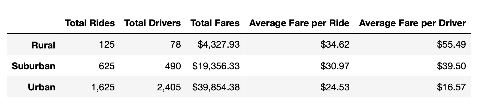
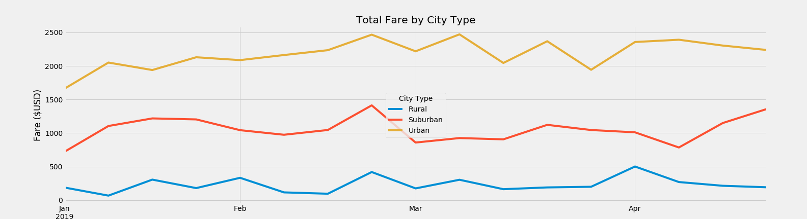

# PyBer Analysis Report

## Background and Results

### Purpose
The purpose of this analysis is to identify the relationship between city type, number of drivers, riders, and ride prices for PyBer, a Python-based ridesharing app company. The results will inform decisions on improving ridesharing services and affordability to underserved communities.

### Technical Analysis
The data was analyzed using Python (3.7.6), Matplotlib (3.1.3), and Jupyter Notebook (6.0.3).

### Results
According to the results, an increase in rides and drivers is correlated to an increase in total fares. This can be seen in the summary dataframe below. However, the greater the rides and driver count, the less expensive the average fare per ride and the average fare per driver.

In addition, the three types of cities, Rural, Suburban, and Urban, have generally consistent fares between the months of January and April 2019, as can be seen below.

### Summary
Total rides surpass the number of drivers in both Rural and Suburban cities. The opposite is true for Urban cities, where the total number of drivers surpasses the number of rides by 780. Despite having the lowest average fare per ride and average fare per driver, Urban cities are producing the greatest fares, with an overall total of $39,854.38 and the highest earnings between January and April 2019.

## Challenges Encountered and Overcome
One of the challenges encountered was calculating the total number of drivers from the merged dataframe pyber_data_df. The program summed every driver count per drive instance instead of summing only the driver count per unique city. This was overcome by using the unmerged city_data_df, which calculated the correct sum.

Another difficulty encountered was printing the pivot table from a dataframe. This was corrected by inserting an additional variable that allowed for the function to perform properly.

## Recommendations and Next Steps

### Recommendations for Future Analysis
Reducing the amount of drivers in Urban cities would increase the average fare per driver for these drivers.
One additional 
### Additional Analysis 1

* Description of Approach
    - One  analysis is to calculate the ratio between the number of drivers and the number of rides.
* Technical Steps
    - The ratio of rides to drivers can be calculated using the total number of drivers and the total rides per city type using the rationFunction().

### Additional Analysis 2

* Description of Approach
    - One additional analysis is to calculate the time of the year when there are the most rides.
* Technical Steps
    - A dataframe can be created from the merged dataframe pyber_data_df using the df.copy() function to show only the date and fare. Next, the df.loc() function can be used to narrow the scope of the data to rides between January and December 2019. Lastly, the df.plot() function can be used to plot the dataframe using the the object-oriented method.